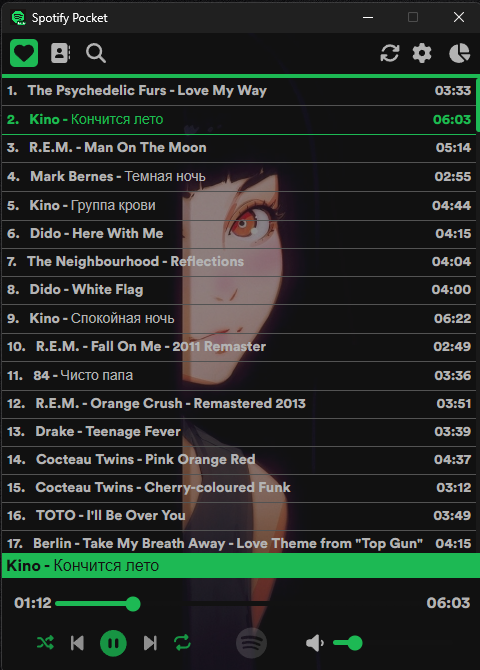

# Spotify Pocket (Winamp alike)

Spotify minimalist player.

## Demo Video:
https://github.com/user-attachments/assets/a4bb567e-4a6e-4c68-98e3-f1aeefb7823b

This app idea came to me after getting annoyed with the original Spotify App, which is slow and renders too many useless things on the screen. When I was younger I used Winamp, which was a simple app that just shown our songs and played it. 

Also I used this app to improve my skills in Rust and React. 

## Tools:
- Rust (back-end) 
    - Tauri 2.0
    - Reqwest
    - Axum
    - Tokio
 
- React (front-end)
    - TypeScript
    - Spotify API
    - Spotify SDK
    - React Router
    - React Query (TanStack)
    - Zustand

## TODOS:

### Fixes:
- [x] Fix on song start playing seek counter buggy (on start 0.1 resets to 0.0 for no reason, and on song ending does 1 sec more).
- [x] Fix Login behaviour.
- [ ] Fix scroll search tags.
- [ ] Fix on idle app stop working (token expired).
- [ ] Fix playlist name scrolling-text.
- [ ] Fix volume bubble dynamic left
- [ ] Graph page that shows user's top items (Wrapped style).
- [ ] Organize Rust functions.
- [ ] Fix TypeScript/Rust errors for build.
- [ ] Fix App on build (get songs and player not working).
- [x] Make No data found component to show on data null.
- [ ] Follow rules for publishing (https://developer.spotify.com/documentation/design#using-our-content).

### Design:
- [ ] Design SettingsPage
- [ ] Design Log out button

### Profile Preferences:
- [~] Settings Page (Log out).
- [x] Log out button
- [ ] Dark/Light mode
- [ ] Custom Themes
- [ ] User Options
- [ ] Player Opacity inside User Options.
- [ ] Background Image inside User Options.

### New Features:
- [x] Searched songs check if already liked (https://developer.spotify.com/documentation/web-api/reference/check-users-saved-tracks).
- [x] Playlist songs check if already liked.
- [ ] Get user profile info (https://developer.spotify.com/documentation/web-api/reference/get-users-profile).
- [ ] Get user top items (https://developer.spotify.com/documentation/web-api/reference/get-users-top-artists-and-tracks).
- [ ] Add song to liked/playlist.
- [ ] Make player custom buttons on hover windows taskbar.
- [ ] Remove song to liked/playlist.
- [x] Search songs.
- [x] Search playlists.
- [ ] Search albums.
- [ ] Search podcasts.
- [ ] Search episodes.
- [ ] Filter button (search inside liked songs).
- [ ] Play specific searched albums/playlists/podcasts.
- [ ] Get recommendations (https://developer.spotify.com/documentation/web-api/reference/get-recommendations).
- [ ] Follow Playlist/Artist.

### Done
- [x] Spotify Authentication (API).
- [x] Spotify Player (SDK).
- [x] Spotify auto connect to device.
- [x] Spotify Auto refresh token.
- [x] Frontend loading screen (wait for Auth + Connect Device).
- [x] Get Liked Songs (top 50 working).
- [x] List Liked Songs (Test showing top 50 working).
- [x] Play/Pause/Next/Prev buttons.
- [x] Volume slider.
- [x] Song timestamp slider.
- [x] On click set specific song.
- [x] Refactor Spotify Playback SDK to global state (useContext).
- [x] On token expired refresh token automatically.
- [x] Refactor get songs to use React Query.
- [x] Refactor react code (organize in components/containers).
- [x] Refactor Player Controls design.
- [x] Refactor List Songs design.
- [x] On Scroll down request + 50 songs.
- [x] Add repeat button.
- [x] Add shuffle button.
- [x] Make proper Loading component for multiple uses (animation spinning);
- [x] Create navbar
- [x] Refactored SpotifyPlayer & Auth from useContext to Zustand.
- [x] Fix fail to change song 401 on token expired.
- [x] Fix on user not logged, render only login page.
- [x] Design login page.
- [x] New Tab (Playlists) React Router maybe. 
- [x] Search User's Playlists.
- [x] Select playlist to play.
- [x] Get songs from playlist (and play song).
- [x] Search songs and play it.
- [x] Background Image.
- [x] check songs that don't get active for some uri reason (childish gambino - me and your mama)
