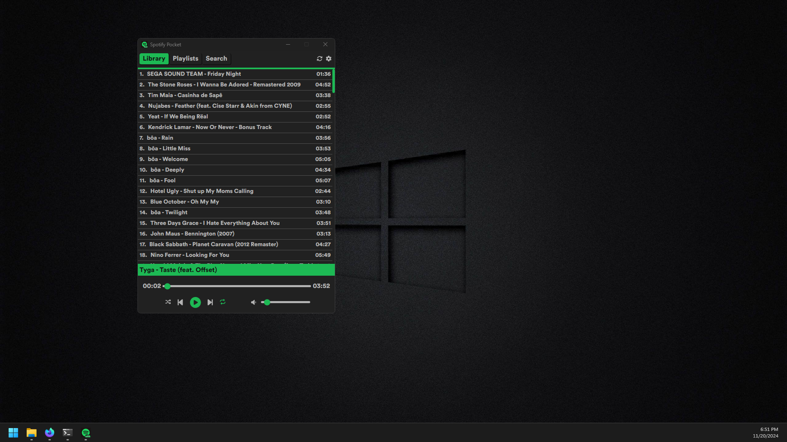

# Spotify Pocket (Winamp alike)

Spotify minimalist player.

This app idea came to me after getting annoyed with the original Spotify App, which is slow and renders too many useless things on the screen. When I was younger I used Winamp, which was a simple app that shown our songs and played it. 

Also I used this app to improve my skills in Rust and React. 

## Tools:
- Rust (back-end) 
    - Tauri 2.0
    - Reqwest
    - Axum
    - Tokio
 
- React (front-end)
    - TypeScript
    - Spotify API
    - Spotify SDK
    - React Router
    - React Query (TanStack)
    - Zustand

## TODOS:
- [x] Spotify Authentication (API).
- [x] Spotify Player (SDK).
- [x] Spotify auto connect to device.
- [x] Spotify Auto refresh token.
- [x] Frontend loading screen (wait for Auth + Connect Device).
- [x] Get Liked Songs (top 50 working).
- [x] List Liked Songs (Test showing top 50 working).
- [x] Play/Pause/Next/Prev buttons.
- [x] Volume slider.
- [x] Song timestamp slider.
- [x] On click set specific song.
- [x] Refactor Spotify Playback SDK to global state (useContext).
- [x] On token expired refresh token automatically.
- [x] Refactor get songs to use React Query.
- [x] Refactor react code (organize in components/containers).
- [x] Refactor Player Controls design.
- [x] Refactor List Songs design.
- [x] On Scroll down request + 50 songs.
- [x] Add repeat button.
- [x] Add shuffle button.
- [x] Make proper Loading component for multiple uses (animation spinning);
- [x] Create navbar
- [x] Refactored SpotifyPlayer & Auth from useContext to Zustand.
- [x] Fix fail to change song 401 on token expired.
- [x] Fix on user not logged, render only login page.
- [x] Design login page.

## Later
- [x] New Tab (Playlists) React Router maybe. 
- [x] Search User's Playlists.
- [ ] Search button (search inside liked songs).
- [x] Select playlist to play.
- [x] Get songs from playlist (and play song).
- [ ] Search albums/songs/playlists/podcasts.
- [ ] Play specific searched albums/songs/playlists/podcasts.
- [ ] Add song to liked/playlist.
- [ ] Remove song to liked/playlist.
- [x] check songs that don't get active for some uri reason (childish gambino - me and your mama)
- [ ] Log off button
- [ ] Dark/Light mode
- [ ] Custom Themes
- [ ] User Options?
- [ ] Fix TypeScript/Rust errors for build.
- [ ] Organize Rust functions.

